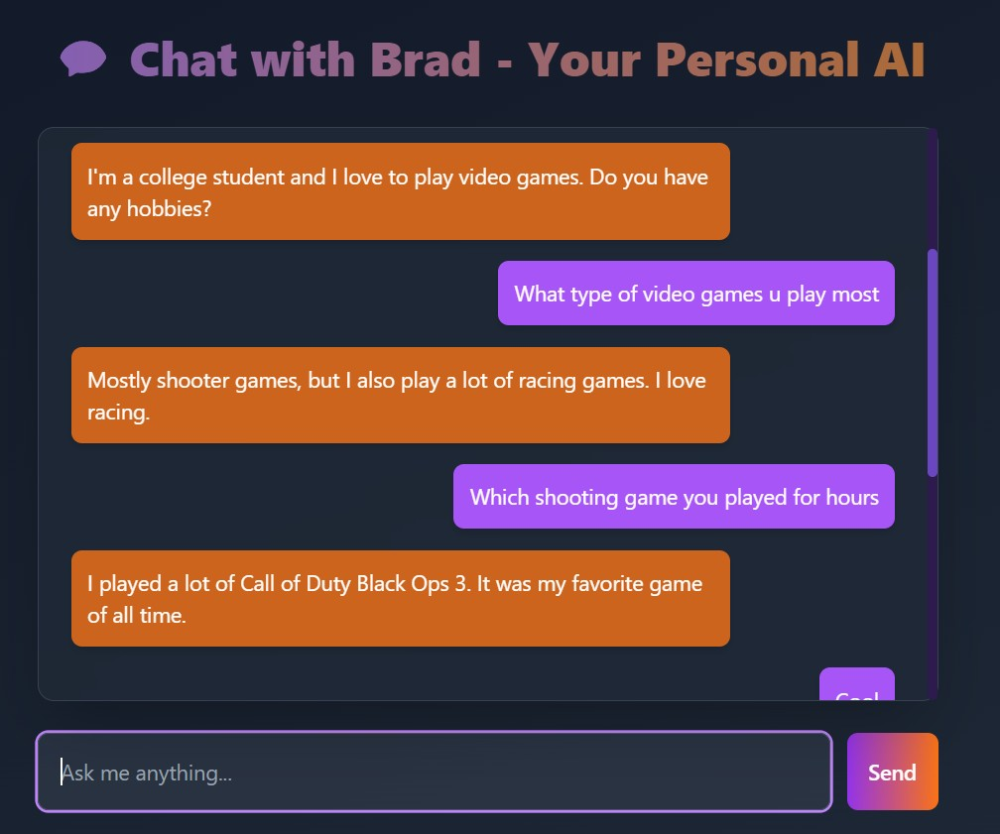

# 🤖 GenAI Chatbot (Django + Flask + Hugging Face)

A conversational web chatbot built using Django (frontend & backend), Flask (AI API), Hugging Face's GenAI model, MongoDB (chat logs), and SQLite (user data). It features a stylish UI built with Tailwind CSS and interactive chat powered by a generative language model.

---

## ChatBot UI



---

## 📌 Features

- 🔗 Frontend in **Django** with dynamic HTML templates
- 🌐 AI backend using **Flask** + **Hugging Face Transformers**
- 🧠 GenAI model: `facebook/blenderbot-400M-distill`
- 🗃️ **SQLite** for user registration
- 🗂️ **MongoDB** for persistent chat logs
- 🧑‍💻 Styled, interactive UI with **Tailwind CSS**
- 🌍 RESTful integration between Django & Flask via JavaScript `fetch()`

---

## 🧰 Technologies Used

- Python 3.8+
- Django
- Flask
- Tailwind CSS (via CDN)
- Hugging Face Transformers
- Torch (PyTorch backend)
- MongoDB (local)
- SQLite (default Django DB)
- Git for version control

---

## 🚀 Getting Started

### 1. Clone the Repository

```bash
git clone https://github.com/Pushparaj95/genai-chatbot.git
cd genai-chatbot
```

### 2. Create and Activate Virtual Environment

```bash
python -m venv venv
source venv/bin/activate      # On Windows: venv\Scripts\activate
```

### 3. Install Requirements

```bash
pip install django flask pymongo flask-cors python-dotenv transformers torch requests
```

---

## 🏗️ Project Structure

```
genai-chatbot/
├── chatbot_project/
│   ├── api.py                  # Flask app
│   ├── chatbot_project/        # Django settings
│   └── chatapp/                # Django app
│       ├── views.py
│       ├── models.py
│       ├── urls.py
│       └── templates/chatapp/
│           ├── home.html       # Chat UI
│           └── register.html   # Registration form
├── db.sqlite3                  # SQLite DB (Django)
├── requirements.txt
└── README.md
```

---

## ⚙️ Running the Application

### Start MongoDB

Ensure MongoDB is running locally:

```bash
mongod
```

### Start the Flask GenAI API

```bash
cd chatbot_project
python api.py
```

### Start the Django Server

```bash
cd chatbot_project
python manage.py runserver
```

Now visit: [http://127.0.0.1:8000](http://127.0.0.1:8000)

---

## 🧪 How It Works

1. User opens the chat interface (`/`)
2. Enters a message in the input field
3. JavaScript sends it to the Flask API (`/api/chat`)
4. Flask uses Hugging Face model to generate a response
5. Response is sent back to frontend and shown
6. Message/response is saved in MongoDB for history

---

## 📚 Learn More

* [Django Docs](https://docs.djangoproject.com/en/4.2/)
* [Flask Docs](https://flask.palletsprojects.com/)
* [Hugging Face Transformers](https://huggingface.co/docs/transformers/index)
* [MongoDB Manual](https://www.mongodb.com/docs/manual/)

---

## 👨‍💼 Author

**Pushparaj Madhavan**

- Contributions and stars are welcome ⭐
- If you liked this, please consider giving it a ⭐ on GitHub!

---